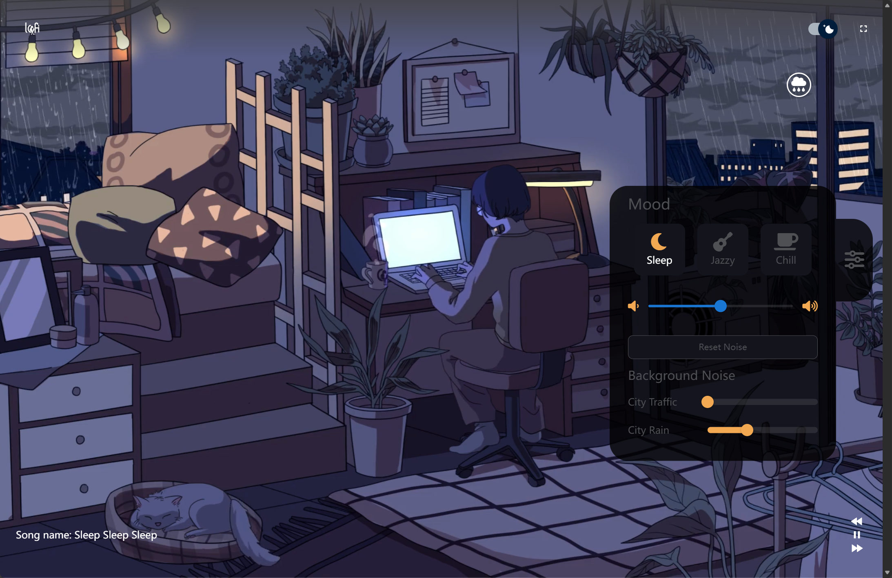
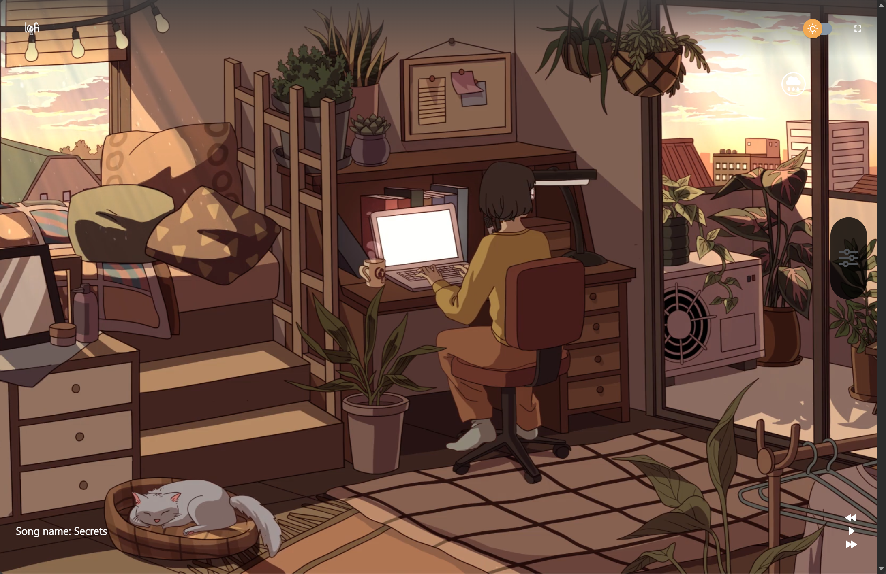

# Lofi Music Website

一个基于 React 的 Lo-fi 音乐播放器，提供沉浸式音乐体验和自定义环境音效。






## 功能特性

- 🎵 **音乐播放** - 支持 Lo-fi 音乐播放，包含播放、暂停、上一首、下一首功能
- 🌤️ **天气切换** - 支持晴天和雨天两种天气模式，自动切换背景视频
- 🌙 **日夜模式** - 支持白天和黑夜模式切换
- 🎚️ **Mood 模式** - 三种预设情绪模式：Sleep、Jazzy、Chill，每种模式配置不同的背景音效
- 🔊 **背景音效** - 12种环境音效可独立调节音量：
  - City Traffic（城市交通）
  - City Rain（城市雨声）
  - Fireplace（壁炉）
  - Snow（雪声）
  - Summer Storm（夏日风暴）
  - Fan（风扇）
  - Forest Night（森林夜晚）
  - Wave（海浪）
  - Wind（风声）
  - People（人声）
  - River（河流）
  - Rain Forest（雨林）
- 🎬 **动态背景** - 根据时间和天气自动切换背景视频
- 📱 **响应式设计** - 适配不同屏幕尺寸
- 🔊 **音量控制** - 主音量和各背景音效独立控制

## 技术栈

- **前端框架**: React 18.2.0
- **状态管理**: Redux Toolkit
- **样式**: SCSS
- **UI 组件**: Material-UI
- **音频播放**: React Audio Player
- **构建工具**: Create React App
- **语言**: TypeScript

## 安装

```bash
# 克隆项目
git clone <repository-url>

# 进入项目目录
cd lofi-music-website

# 安装依赖
npm install
# 或
yarn install
```

## 使用

### 开发模式

```bash
npm start
# 或
yarn start
```

应用将在 `http://localhost:3005` 启动

### 生产构建

```bash
npm run build
# 或
yarn build
```

构建文件将输出到 `build/` 目录

## 项目结构

```
lofi-music-website/
├── public/                 # 静态资源
│   ├── assets/
│   │   ├── icons/         # 图标文件
│   │   ├── lofi/          # Lo-fi 音乐文件
│   │   ├── musics/        # 背景音效文件
│   │   └── video/         # 背景视频文件
│   └── index.html
├── src/
│   ├── components/        # React 组件
│   │   ├── DarkLightSwitch/    # 日夜切换组件
│   │   ├── Home/               # 首页组件
│   │   ├── Message/            # 消息组件
│   │   ├── Model/              # 模态框组件
│   │   ├── ModifierBoard/      # Mood 面板组件
│   │   ├── Player/             # 音乐播放器组件
│   │   └── RainToggleButton/   # 天气切换按钮组件
│   ├── config/            # 配置文件
│   │   └── audioConfig.ts      # 音频配置
│   ├── constants/         # 常量定义
│   ├── data/              # 数据文件
│   ├── layout/            # 布局组件
│   │   ├── Header/             # 头部组件
│   │   └── Footer/             # 底部组件
│   ├── pages/             # 页面组件
│   ├── store/             # Redux 状态管理
│   │   └── slice/             # Redux slices
│   ├── types/             # TypeScript 类型定义
│   ├── App.tsx            # 根组件
│   ├── index.scss         # 全局样式
│   └── index.tsx          # 入口文件
├── package.json
└── tsconfig.json
```

## 配置说明

### 音频配置 (audioConfig.ts)

项目使用集中化的音频配置系统，所有音频相关设置都在 `src/config/audioConfig.ts` 中定义：

- **AUDIO_FILE_NAME_MAP**: 音频文件名映射
- **NOISE_VOLUME_OFFSETS**: 各音效的音量偏差值，用于平衡不同音效的音量
- **RAINY_BACKGROUND_CONFIG**: 雨天背景触发配置
- **MOOD_NOISE_PRESETS**: 三种 Mood 模式的音效预设
- **WEATHER_NOISE_PRESETS**: 天气模式的音效预设

### Mood 模式预设

- **Sleep**: 适合睡眠，包含风扇和森林夜晚音效
- **Jazzy**: 适合爵士乐氛围，包含城市交通和人声
- **Chill**: 适合放松，包含壁炉、海浪和河流音效

### 天气模式预设

- **Clear**: 晴天，无额外音效
- **Rain**: 雨天，包含城市雨声、风声和雨林音效

## 核心功能实现

### 状态管理

使用 Redux Toolkit 管理应用状态，主要状态包括：

- **mode**: 日夜模式（day/night）
- **weather**: 天气模式（clear/rain）
- **mood**: 情绪模式（sleep/jazzy/chill）
- **backgroundNoise**: 背景音效音量配置

### 背景视频切换

背景视频根据以下规则自动切换：
- 时间模式：白天/黑夜
- 天气模式：晴天/雨天
- 音效阈值：当雨相关音效（cityRain、summerStorm、rainForest）总音量超过阈值时显示雨天背景

### 音效连续播放

所有背景音效的音频播放器始终存在，不会在 UI 交互时重新创建，确保音效连续播放。

## 开发说明

### 添加新的背景音效

1. 将音频文件添加到 `public/assets/musics/` 目录
2. 在 `src/config/audioConfig.ts` 中添加文件名映射
3. 在 `NOISE_VOLUME_OFFSETS` 中设置音量偏差值
4. 在 `MOOD_NOISE_PRESETS` 或 `WEATHER_NOISE_PRESETS` 中配置预设音量

### 修改 Mood 预设

编辑 `src/config/audioConfig.ts` 中的 `MOOD_NOISE_PRESETS` 对象，调整各音效的默认音量值。

### 调整音量偏差

编辑 `src/config/audioConfig.ts` 中的 `NOISE_VOLUME_OFFSETS` 对象，调整各音效的音量偏差系数。

## 浏览器支持

- Chrome (最新版本)
- Firefox (最新版本)
- Safari (最新版本)
- Edge (最新版本)

## 许可证

见 LICENSE 文件

## 贡献

欢迎提交 Issue 和 Pull Request！

## 致谢

本项目灵感来源于 [lofi-music-website](https://github.com/menoc61/lofi-music-website.git)，感谢原作者的创意和贡献。